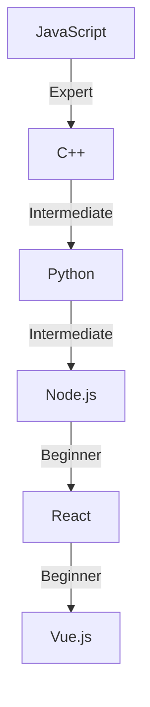

<h1 align="center">Hi 👋, I'm Rahul</h1>
<h3 align="center">Computer Science | Quantum Computing Student | Reclusive like a neutrino | A photon to the Higgs field of giving up.</h3>

  

## 🚀 About Me
- 🔭 I’m currently working on [Raskbind Coffee](https://raskbindcoffee.shop/)
- 👯 I’m looking to collaborate on [Bluelearn](https://www.bluelearn.in/)
- 🤝 I’m looking for help with [Raskbind Coffee](https://raskbindcoffee.shop/)
- 📫 How to reach me: **rahulkumar35d@gmail.com**

## 🌐 Connect with Me

  
  
  

## 🛠️ Languages & Tools

  
  
  
  
  
  
  
  
  

## 📊 GitHub Stats

  

## 📈 Experience Breakdown

